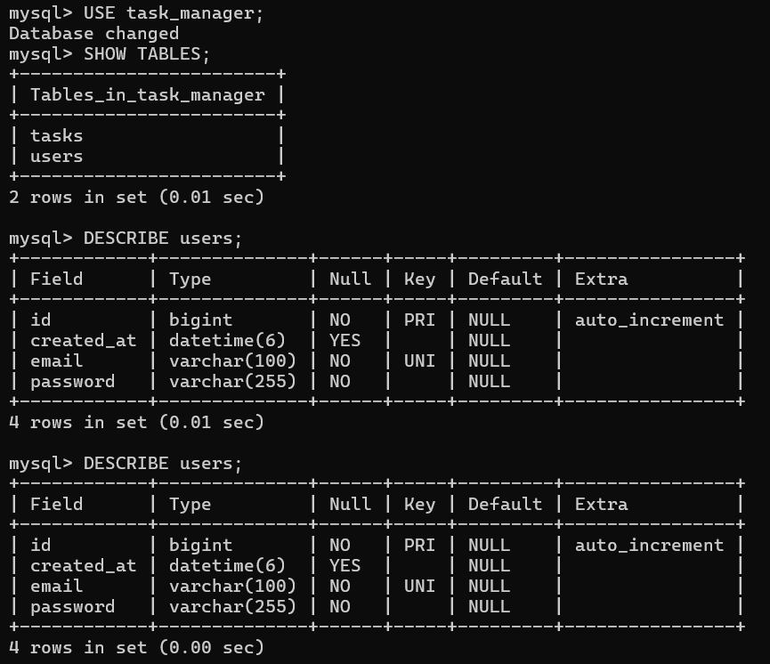

# Task Manager App

I made this task management web app for my Java full stack developer internship assignment.

## What it does

Anyone can sign up with email and password. After logging in, you can add tasks, edit them, delete them, and change their status (Todo, In Progress, Done). Each task has a title, description, priority, due date, and status.

There's also an AI button. When you're adding a task, type the title and click the AI button. It fills in the description, picks a priority, and guesses how many hours it might take. It uses Google's Gemini API for this.

## Tech stack

**Backend:** Java 21, Spring Boot 4.0.6, Spring Security with JWT, MySQL, Spring Data JPA

**Frontend:** React 18, Vite, Tailwind CSS, Axios, React Router

**AI:** Google Gemini API

## How to run this

**Requirements:**
- Java 21
- Node.js
- MySQL
- Eclipse
- VS Code

**1. Setup database**

Open MySQL and run:

CREATE DATABASE task_manager;
CREATE USER 'taskuser'@'localhost' IDENTIFIED BY 'task123';
GRANT ALL PRIVILEGES ON task_manager.* TO 'taskuser'@'localhost';

**2. Run backend**

Open Eclipse and import the backend project. You need a Gemini API key from Google AI Studio. It's free. Put it in application.properties file like this:

gemini.api.key=your_key_here

Then run TaskManagementBackendApplication.java. The backend starts on port 8080.

**3. Run frontend**

Open the frontend folder in VS Code. Open terminal and run:

npm install
npm run dev

Then open http://localhost:5173 in your browser.

**4. Use the app**

Register a new account, login, then start adding tasks. Try the AI button.

## AI button details

When you click the AI button:

- Frontend sends your task title to /api/ai/generate
- Backend calls Gemini API with a prompt
- Gemini returns description, priority, and estimated hours
- The form fills automatically with this data

If Gemini API fails (sometimes it gives a 503 error when too busy), my backend returns a simple fallback response so the app still works.

## Screenshots

**Login Page**

**Register Page**

**Task Dashboard**

**AI Generation**

**Dashboard View**

## Database Schema (ER Diagram)

Here is the database schema screenshot showing users and tasks tables:

**Tables explained:**

- **users** - stores user account details (id, email, password, created_at)
- **tasks** - stores task details (id, title, description, priority, status, due_date, user_id)

**Relation:** One user can have many tasks. `tasks.user_id` connects to `users.id`

## Architecture

Browser (React) → Backend API (Spring Boot :8080) → MySQL Database
                                    ↓
                            Google Gemini API

## API endpoints I made

These are all the APIs created in the backend:

**Authentication (no token needed):**

| Method | Endpoint | What it does |
|--------|----------|--------------|
| POST | /api/auth/register | Creates a new user account |
| POST | /api/auth/login | Logs you in and gives a JWT token |

**Task management (need to send the JWT token in header):**

| Method | Endpoint | What it does |
|--------|----------|--------------|
| GET | /api/tasks | Gets all your tasks |
| POST | /api/tasks | Creates a new task |
| PUT | /api/tasks/{id} | Updates an existing task |
| DELETE | /api/tasks/{id} | Deletes a task |
| PATCH | /api/tasks/{id}/status?status=IN_PROGRESS | Changes task status |

**AI (also needs token):**

| Method | Endpoint | What it does |
|--------|----------|--------------|
| POST | /api/ai/generate | Sends task title to Gemini API and returns description, priority, estimated hours |

## Problems I faced while building this

**CORS issue in Spring Boot 4.0** - The old way of using allowedOrigins("*") with credentials doesn't work anymore. I had to use allowedOriginPatterns instead.

**Gemini API rate limits** - The free tier sometimes returns 503 errors. I added a fallback mechanism so users don't see a broken feature.

**MySQL dialect error** - In Spring Boot 4.0, MySQL8Dialect class doesn't exist. I changed it to just MySQLDialect.

**Port 8080 already in use** - Sometimes the port was busy. I had to find and kill the existing process.

## Author
Pawan Katkhede

## Date
21 May 2026